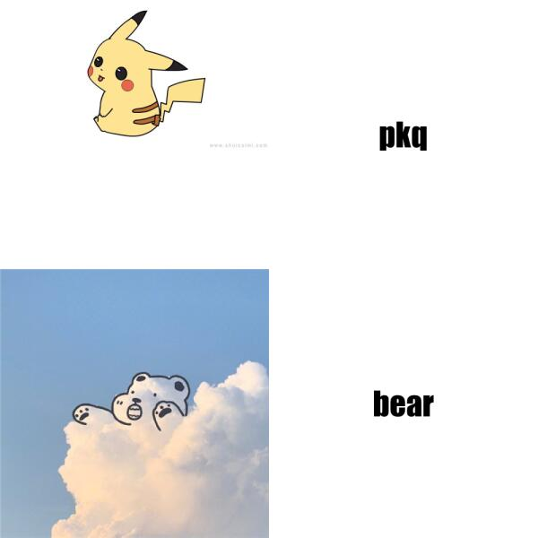

# Meme by R code
This file displays the **meme** that I created using the following R code with the *magick* package.

## Source R code

```r
library(magick)
library(tidyverse)

pkq <- image_read("https://img.shuicaimi.com/c2020/12/09/0l5qdagaza1.jpg") %>%
  image_scale(500)

Bear<-
  image_read("https://www.ygexing.com/upload/223/new/20210303/15690311636958128.jpg")%>%
  image_scale(500)

wechat_text <- image_blank(width = 500,
                           height = 500,
                           color = "#ffffff")%>%
  image_annotate(text = "pkq",
                 color = "#000000",
                 size = 60,
                 font = "Impact",
                 gravity = "center")

baidu_text <- image_blank(width = 500,
                          height = 500,
                          color = "#ffffff")%>%
  image_annotate(text = "bear",
                 color = "#000000",
                 size = 60,
                 font = "Impact",
                 gravity = "center")

first_row <- c(pkq, wechat_text) %>% image_append()
second_row <- c(Bear, baidu_text) %>% image_append()
hbc <- c(first_row, second_row) %>% image_append(stack = TRUE) %>% image_scale(600)
image_write(hbc, "my_meme.png")
```

## Meme image 



My motivation is to display the two following adorable photos together.
<!--- unordered list--->
* pkq
* bear

From the meme, we can see they are quite similar to each other.
